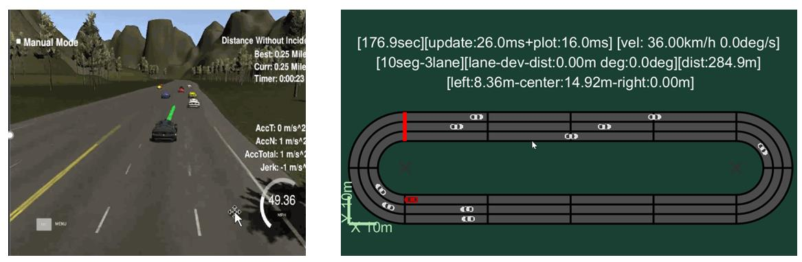

## About Me

Hi, My name is Qianqian Zhou, I am currently a master student in Computer Technology in Xiamen University, China, and I am applying Ph.D. programs in USA. I received the B.E. degree in Communication Engineering in Zhengzhou University in 2016.

I joined the Robotics Lab in my undergraduate school and did some interesting projects. My currently research interests focus on decision and planning for autonomous vehicles, reinforcement learning (RL) and control on mobile robots. It is still challenging to make auto-cars and mobile robots travel in uncertain environment, traditional methods are based on detailed description of the environment, RL enables agents to learn from interacting with the environment, but this trial and error method is inefficient and unsafe, so it is necessary to propose modifications.

## Publications

1. Qianqian Zhou, Fei Chao, and Chih-Min Lin: Intelligent Wavelet Elman Fuzzy Brain Emotional Learning Control for Robotic Systems. NEURAL COMPUTING & APPLICATIONS  (under review IF 4.213)
2. Qianqian Zhou, Fei Chao, and Chih-Min Lin: A Functional- link-based Fuzzy Brain Emotional Learning Network for Breast Tumor Classification and Chaotic System Synchronization. International Journal of Fuzzy Systems: 1-17. 2017（IF 2.39）
3. Qianqian Zhou, Chih-Min Lin, Fei Chao: Adaptive Noise Cancelation using Fuzzy Brain Emotional Learning Network, UK Workshop on Computational Intelligence, 2017

## Projects & Experiences

 **1. Decision and planning algorithm for autonomous cars**

My job was to survey existing methods for decision and planning methods for autonomous cars and develop a model to decide whether lane changing is allowed. I used a gap model and a model based on finite state machine. [Here](Planning & Decision-Making Overview.png) is a brain mapping of the overview about current method of decision and planning for auto-cars.

 **2. Development of fuzzy brain emotional learning (FBEL) neural networks and application on control, classification and adaptive filtering systems**

This is a National Natural Science Foundation Project in my graduate school. I developed modified FBEL networks for robot trajectory tracking and nonlinear systems.The object is to make robots follow the expected trajectories more efficiently and accurately when uncertain noises exist. It can apply on both mobile robots and quadrotor.

 **3. End-to-end robot path planning based on deep reinforcement learning**

I simulated end-to-end robotic path planning on ROS and V-rep using Deep Q-learning Network. The inputs are pictures from a monocular camera, and the agent needs to interact with the environment to collect training data, and it will learn to adjust its actions to maximize  the expected reward given by the environment. This method still needs to be improved to collect training data more efficiently and also mitigate the sparse reward problem, and we need to make sure the robot is safe at the same time. There is much work to do in this field which is also an exciting thing!

**4. Applied adaptive membership function fuzzy control system to the control of bridge crane**

This is the first time I got involved with doing research, fuzzy control was a totally new field for me back then. I used adaptive membership function and neuron to increase the robustness of the control system. For the first time I knew something about doing research, you need to find what is the problem first and learn about the existing methods through a lot of reading and try to propose some methods with better performance. 

 **5. Some interesting projects in Zhengzhou University**

I stayed in the Robotics Lab in my undergraduate school for about a year and a half and did some interesting projects and also participated the Robotics Competition. The following pictures show modularized robotic experimental cases I designed with my friends for beginners learning robots, we only left inputs and outputs so students would not stuck in some details at beginning.

---

## Education
2012.9~2016.7 Zhengzhou University 

GPA 3.3/4, Major GPA 3.7/4, Ranking 4/98

---
2016.9~present Xiamen University

 GPA 89.4/100, Ranking 1/32

