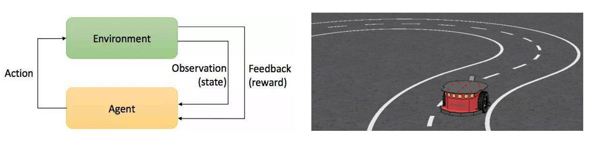

## About Me

I am currently a master student in Computer Technology in Xiamen University and I am applying Ph.D. programs in USA. I received the B.E. degree in Communication Engineering in Zhengzhou University in 2016.

I participated in the Robotics Lab in my undergraduate school and did some interesting projects. My currently research interests focus on decision and planning for autonomous vehicles, reinforcement learning (RL) and control on mobile robots. It is still challenging to make auto-cars and mobile robots travel in uncertain environment, traditional methods are based on detailed description of the environment, RL enables agents to learn from interacting with the environment, but this trial and error method is inefficient and unsafe, so it is necessary to propose modifications.

## Publications

1. Qianqian Zhou, Fei Chao, and Chih-Min Lin: Intelligent Wavelet Elman Fuzzy Brain Emotional Learning Control for Robotic Systems. NEURAL COMPUTING & APPLICATIONS  (under review IF 4.213)
2. Qianqian Zhou, Fei Chao, and Chih-Min Lin: A Functional- link-based Fuzzy Brain Emotional Learning Network for Breast Tumor Classification and Chaotic System Synchronization. International Journal of Fuzzy Systems: 1-17. 2017（IF 2.39）
3. Qianqian Zhou, Chih-Min Lin, Fei Chao: Adaptive Noise Cancelation using Fuzzy Brain Emotional Learning Network, UK Workshop on Computational Intelligence, 2017

## Projects & Experiences
1. **Decision and planning algorithm for autonomous cars**

My job was to survey existing methods for decision and planning methods for autonomous cars and develop a model to decide whether lane changing is allowed. I used a gap model and a model based on finite state machine.[Planning & Decision-Making Overview](Planning & Decision-Making Overview.png)

2. **Development of fuzzy brain emotional learning (FBEL) neural networks and application on control, classification and adaptive filtering systems**

This is a National Natural Science Foundation Project in my graduate school. I developed modified FBEL networks for robot trajectory tracking and nonlinear systems.

3. **End-to-end robot path planning based on deep reinforcement learning**

I simulated end-to-end robotic path planning on ROS and V-rep using Deep Q-learning Network.

4. **Applied adaptive membership function fuzzy control system to the control of bridge crane**

## Typography

This is a [link](http://google.com). Something *italics* and something **bold**.

Here is a table

Year | Award | Category
-----|-------|--------
2014 | Emmy  | Won Outstanding Lead Actor in a miniseries or a movie
2015 | BAFTA | Nominated for Best Leading Actor for Sherlock
2014 | Satellite | Won Best Actor miniseries or television film

Here is a horizontal rule

---

Here is a blockquote

> To a great mind, nothing is little

